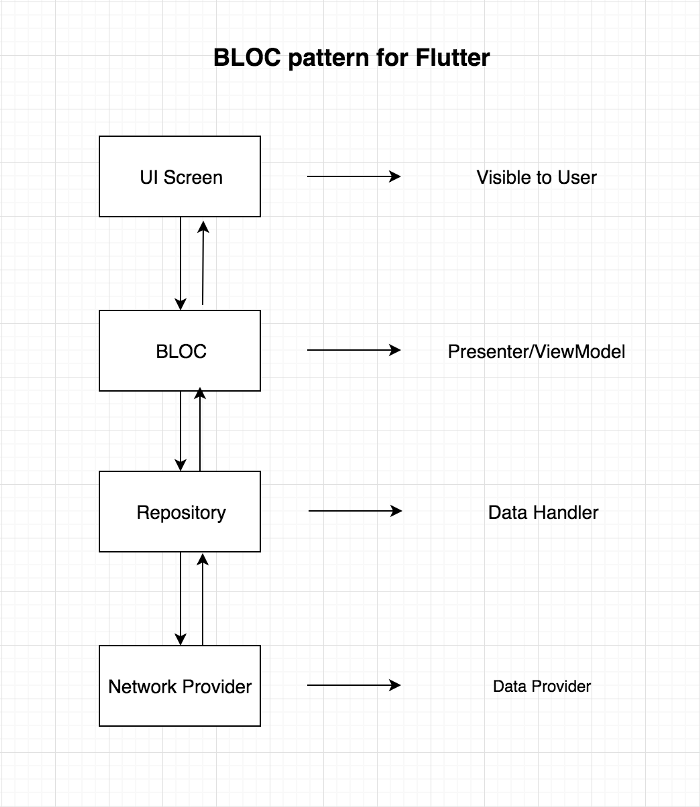

# flutter_app

A demo Flutter application.

## Getting Started

This project is a starting point for a Flutter application.

## App Architecture
The architecture we will be following to structure this app:



The above diagram shows how the data flow from UI to the Data layer and vice versa. 
BLOC will never have any reference of the Widgets in the UI Screen. 
The UI screen will only observe changes coming from BLOC class.


### Detail architecture with multiple Providers


### Folders structure
```
- widgets/									   # common widgets
- blocs/										 # contain global, common ontain business logics for app
- modules/									 # Main structure, all modules, screen and page will be here
---- <module_name>/
------ module_name_screen.dart 				 # contain widget for screens (usually StateFul Widgets, Container Widgets)
------ blocs/  								  # contain business logics for the module
------ widgets/								# contain widgets shared across the module
------ models/								# contain model for module
---- <module_name_2>/
------ module_name_2_screen.dart 		
------ blocs/
------ widgets/
------ models/
- repositories/								#  global classes encapsulate the logic to access data sources, and shared across app.
- models/										# contain common models  shared across the app
---- app_model.dart
- datasources/									# Also understand is data storage layers, which are handle connect to difference data sources
- main.dart
```


The pattern helps you to organize the logic code in the BLoC and separate the business logic from UI. 
If you know about the MVVM (Model-View-ViewModel) pattern, the BLoC is the replacement for ViewModel. 
The BLoC is responsible for managing the state for View, and the Model (or Repository) helps the BLoC to access data no matter local or remote.

A few resources to get you started if this is your first Flutter project:

- [Lab: Write your first Flutter app](https://flutter.dev/docs/get-started/codelab)
- [Cookbook: Useful Flutter samples](https://flutter.dev/docs/cookbook)

For help getting started with Flutter, view 
[online documentation](https://flutter.dev/docs), which offers tutorials,
samples, guidance on mobile development, and a full API reference.
